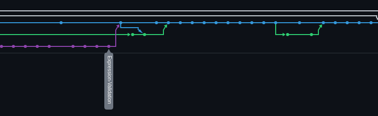
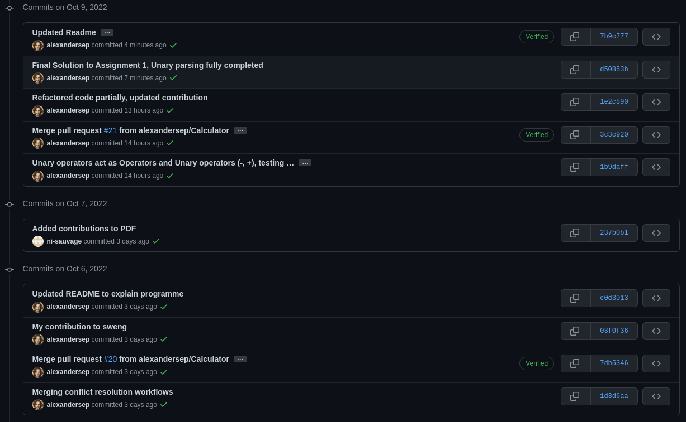
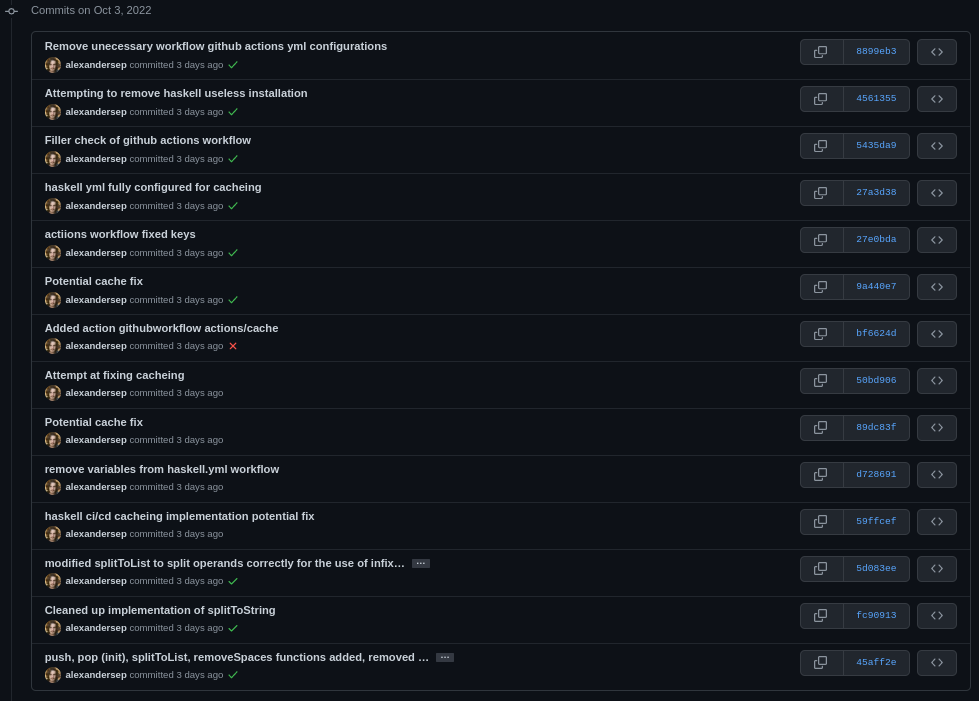

# CSU33012 - Software Engineering - Assignment 1
* Infix validator and calculator written in **Haskell** using *Hunit*, *QuckCheck* 
  for unit testing and github workflow actions.

## Contributors & Contributions
* Alexander Sepelenco
    - Acted as github lead with organising, README, issues, pull requests, 
      github workflow, and setting up Haskell with stack.
    - Set up Haskell unit testing: Hunit, and Quickcheck.
    - Set up github including github workflow with caching.
    - Implemented the following functions and their respective unit tests
      `isOperator`, `iOperand`, `operatorPrecedence`, `errorPrecedence`,
      `isOperatorLeftAssociative`, `errorLeftAssociativity`, `removeSpaces`,
      `splitToList`, `addZeroStringUnaryHeadPositiveOrNegative`,
      `combineUnaryOperators`, `removeUnaryHeadPositive`, `removePlusNum`,
      `combineNum`
    - Implemented the basic Input and Output when running programme. 
    - Implemented Unary parsing, `-` and `+` and ensured it worked effectively
      with Niall's evaluator, and validators.
* Niall Sauvage
    - Implemented the following functions and their respective unit tests 
      `infixValidator`, `popOperatorStackUpToParen`, `infixValidator'`, 
      `countBrackets`, `infixToPostfix`, `popOperatorStack`, `getFirstElem`, 
      `evaluatePostfix`, `evaluatePostfix'`, `evaluateExpression`.
    - Implemented parsing of inputted string into postfix once it has been split.
    - Implemented evaluation of resulting postfix strings into a single answer.
    - Worked on changes to Main.hs.

### Graph/commit logs
* Graph of commit logs \
    * Graph Part 3 \
    
    * Graph Part 2 \
    
    * Graph Part 1 \
    
* Main Branch \
 
\newpage
* Calculator-Branch \
 \

* Expression-Validation Branch \
 \
 \

* Postfix-Prefix Branch \

#### Link To repo
[https://github.com/alexandersep/CSU33012-SWENG-ASS1](https://github.com/alexandersep/CSU33012-SWENG-ASS1) 
