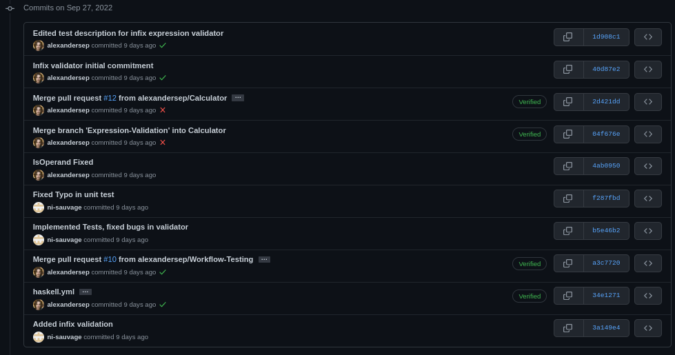

# CSU33012 - Software Engineering - Assignment 1
* Infix validator and calculator written in **Haskell** using *Hunit*, *QuckTest* 
  for unit testing and github workflow actions.

## Contributors
* Alexander Sepelenco, sepelena@tcd.ie
* Niall Sauvage, sauvagen@tcd.ie 

### Contributions
* Alexander Sepelenco
    * Set up github including github workflow with caching
    * Set up Haskell unit testing Hunit, Quickcheck
* Niall Sauvage

#### Graph of commit logs
* Main Branch \
 \
* Calculator-Branch \
 \
 \
* Expression-Validation Branch \
 \
 \
 \
* Postfix-Prefix Branch \
 \

#### Link To repo
[Repo](https://github.com/alexandersep/CSU33012-SWENG-ASS1) 

You need to submit a short document with a brief description of the contribution of each member, 
a link to the repo and a graph of the commit log.

