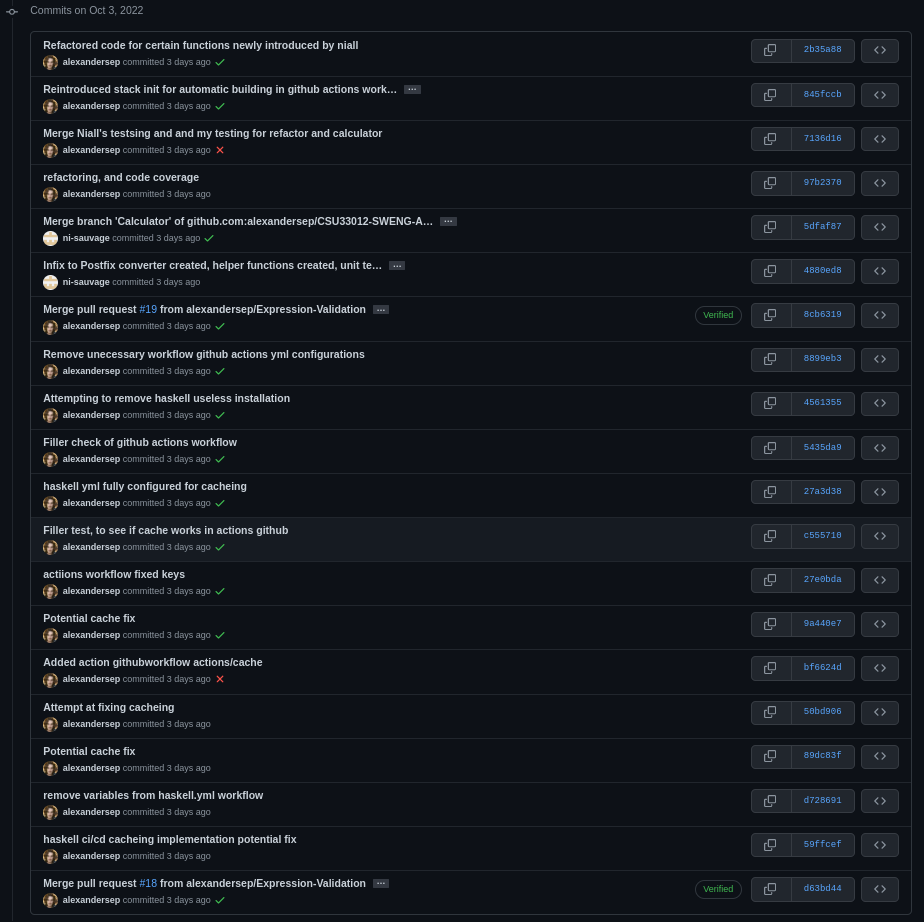

# CSU33012 - Software Engineering - Assignment 1
* Infix validator and calculator written in **Haskell** using *Hunit*, *QuckTest* 
  for unit testing and github workflow actions.

## Contributors & Contributions
* Alexander Sepelenco
    - Acted as github lead with organising, README, issues, pull requests, 
      github workflow, and setting up Haskell with stack. 
    - Set up github including github workflow with caching.
    - Set up Haskell unit testing Hunit, Quickcheck.
    - Implemented unit tests and functions for `isOperator`, `iOperand`,
      `operatorPrecedence`, `errorPrecedence`, `isOperatorLeftAssociative`, 
      `errorLeftAssociativity`, `removeSpaces`, `splitToList`.
    - Implemented the basic Input and Output when running programme. 
* Niall Sauvage
    - Implemented the following functions and their respective unit tests `infixValidator`, `popOperatorStackUpToParen`,
      `infixValidator'`, `countBrackets`, `infixToPostfix`, 
      `popOperatorStack`, `getFirstElem`, `evaluatePostfix`, `evaluatePostfix'`,
      `evaluateExpression`.
    - Implemented parsing of inputted string into postfix once it has been split.
    - Implemented evaluation of resulting postfix strings into single answer.
    - Worked on changes to Main.hs.

### Graph of commit logs
* Main Branch \
 
\newpage
* Calculator-Branch \
 \

* Expression-Validation Branch \
 \
 \

* Postfix-Prefix Branch \

#### Link To repo
[https://github.com/alexandersep/CSU33012-SWENG-ASS1](https://github.com/alexandersep/CSU33012-SWENG-ASS1) 
